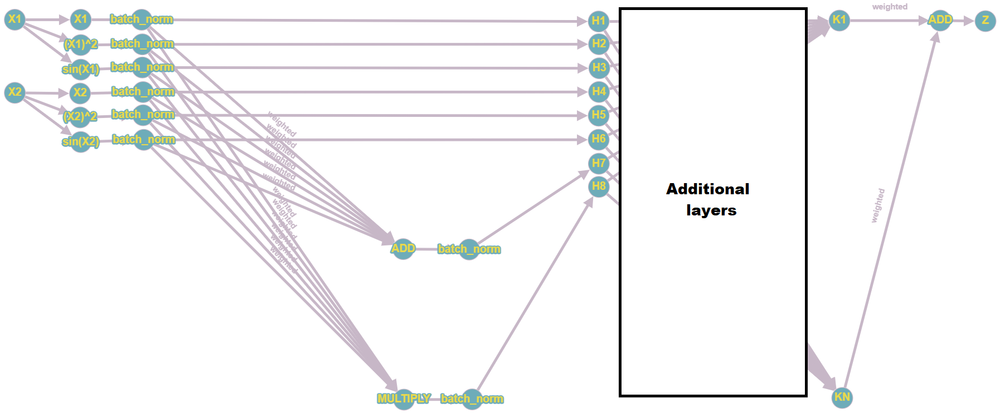

# Symbolic Regression via Gradient Descent
Given a dataset of features and a target, symbolic regression is a method to extract a mathematical equation that approximates the relationship between the features and the target.

## Table of Contents
* [Motivation](#motivation)
* [Neural Network Structure](#neural-network-structure)
* [Training Details](#training-details)
* [Extraction Algorithm](#extraction-algorithm)
* [Requirements](#requirements)
* [Commentary](#commentary)
* [Additional Reading](#additional-reading)

### Motivation
Many regression techniques exist, all with advantages and disadvantages. On one side, linear regression is the most simplest form of regression and its advantage is in the explainability of the model. The disadvantage is that it makes an assumption that the target has a linear relationship with the features, and in the case that this is not true, the model won't fit as well to the data. On the other side, neural networks are able to fit any kind of function, but the downside is that the model is often considered a "black box" and not interpretable.

Symbolic regression is an alternative regression technique that makes no assumptions on the underlying relationship between the features and the target, and at the same time, could also potentially have a more explainable model. 

Traditionally, symbolic regression techniques were based on genetic algorithms, where equations are initially generated randomly. Then the equations with the highest score (e.g. lowest mean squared error with the target) are selected for the next iteration of the algorithm. The equations are then mutated slightly and the process is repeated again, until convergence. Convergence is not guaranteed, however, as it can be dependent on the initial pool of equations generated, and hyperparameter choices like the maximum runtime for the algorithm and the maximum length of a given equation.

Therefore, I tried to approach symbolic regression via a gradient descent method, in hopes that optimizing directly for the loss function would give it more consistent results compared to the randomness of genetic algorithms.

### Neural Network Structure

A neural network with a unique structure is used to fit to the data:
* First the inputs (denoted X1 and X2 in the above diagram) are passed through a set of activation functions (the identity, square and sine function in the above diagram)
* The activation function outputs are then passed through a batch normalization layer
* The batch-normalized activation function outputs are used as inputs for the next layer (denoted as H1 to H6 in the above diagram)
* The batch-normalized activation function outputs are also passed to an addition operator and a multiplication operator, each weighted with individual weights
* The output of the addition and multplication operators are then batch normalized and used as inputs for the next layer (denoted as H7 and H8 respectively in the above diagram)
* The outputs of this layer (denoted as H1 to H8 in the above diagram) are used as inputs for the next layer (where they will be passed onto activation functions and then the addition and multiplication operator)
* On the final layer, the outputs (denoted as K1 to KN in the above diagram) are passed to an addition operator, each weighted with individual weights, and the sum is taken as the final output of the neural network

### Training Details
The data is z-normalized and then the neural network is used to train on this data. Learning rate is decayed every time the loss value of either the training or validation set is higher than the average of the loss values of the past 10 iterations (this number can be changed as a hyperparameter). Training stops when either the loss reaches a certain threshold, or when the learning rate decays to a certain threshold.

### Extraction Algorithm
Once the neural network is done training, the structure of the network is extracted into a mathematical equation. The extraction algorithm starts with the final output neuron of the neural network, and replaces it with a mathematical expression, denoting the summation of the previous layer's outputs. It then recursively replaces each neuron output with a mathematical expression equivalent to the operator's function (i.e. addition, multiplication, activation functions, and batch normalization), until the remaining neurons in the mathematical expression are the input neurons of the neural network.

The equation is then expanded and simplified, and then the equation weights and coefficients are iteratively rounded to the nearest 0 to 12 digits (this number can be changed as a hyperparameter). It then performs testing with these rounded equations and keeps the one that performs the best.

### Requirements
* Python 3.7.4
* Tensorflow 2.3.0
* Scikit-learn 0.21.3
* Numpy 1.16.4
* Sympy 1.7.1

### Commentary
The algorithm indeed converges for simple equations, but has difficulty for more complex ones. Stacking additional layers, and adding additional activation functions has two effects:
* It exponentially increases the time it takes for the equation to be extracted due to the increase in time expanding and simplifying the equation
* It also runs the risk of blowing up the outputs due to the multiply operator receiving more and more inputs

Normalizing the data and batch normalizing layer outputs were used to counteract this and while it alleviates the issue a little bit, it doesn't eliminate the problem.

I also tried counteracting this by forcing the weights of the inputs going into the multiplication operator to be either 0 or 1 (i.e. a selection layer of some sort). I experimented with using binary weights on a toy example, but had trouble with the network training stalling when the weights reached 0, as the gradient for the previous layer weights would also be 0. There's also the edge case where if the gradient only updates the weights to values beyond the 1 or 0 threshold, the weight values would not change and thus the network training would stall. As such, I haven't tried binary weights on the neural network structure I described above for symbolic regression.

L1 regularization was tried to force more weights to be 0, but it didn't seem to work for varying values I tried. Experimentally, the algorithm performed better without any regularization at all.

### Additional Reading
* [AI Feynman](https://arxiv.org/pdf/1905.11481.pdf)
* [AI Feynman 2.0](https://arxiv.org/pdf/2006.10782.pdf)
* [BinaryConnect](https://arxiv.org/pdf/1511.00363.pdf)